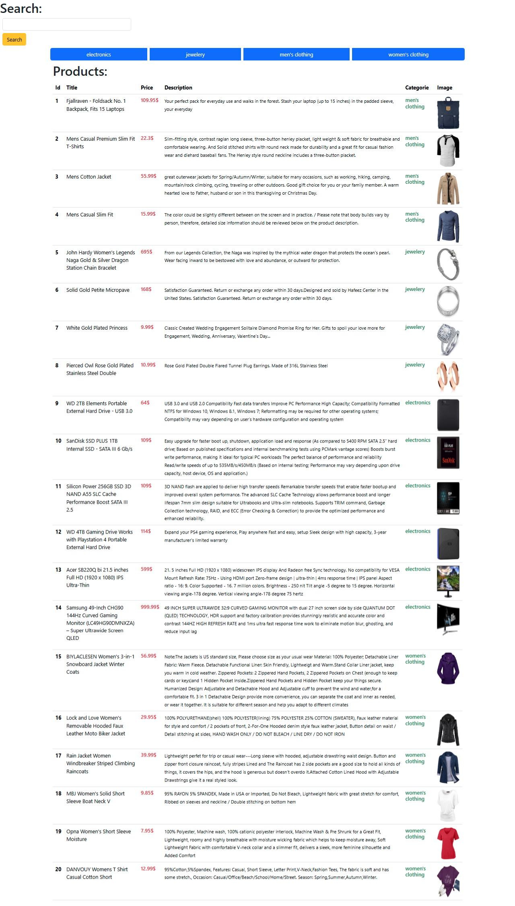

# 🛍️ Simple-ShopFilter-App

**Simple-ShopFilter-App** is a modern and minimalistic web application built with **React** that allows users to browse, search, and filter products fetched from a fake store API. It displays a table of products with useful information like category, price, description, and image.



---

## 📌 Features

- 🔍 **Search**: Instantly search for products by title or keyword.
- 📁 **Category Filter**: Filter products by category — electronics, jewelry, men's clothing, and women's clothing.
- 🛒 **Product Display**: View a list of products with ID, name, price, description, category, and image.
- ⚡ **Fast & Dynamic UI**: Built using React Hooks for dynamic rendering and quick filtering.
- 🧑‍🎨 **Responsive Design**: Clean and user-friendly layout styled with **Bootstrap**.

---

## 🚀 Getting Started

To run this project locally:

1. Clone the repository:
   ```bash
   git clone https://github.com/Reda-Ganoutre01/Simple-ShopFilter-App.git
   ```
2. Navigate to the project directory:
   ```bash
   cd simple-shopfilter-app
   ```
3. Install dependencies:
   ```bash
   npm install
   ```
4. Start the development server:
   ```bash
   npm start
   ```

---

## 🛠️ Built With

- **React**: A JavaScript library for building user interfaces.
- **Fake Store API**: A free API for testing and prototyping e-commerce applications.
- **Bootstrap**: A popular CSS framework for responsive and mobile-first web development.

---

## 📁 Project Structure

```bash
simple-shopfilter-app/
├── .gitignore
├── package.json
├── README.md
├── assets/
│   └── Screen_Web.png
├── public/
│   ├── bootstrap.css
│   └── index.html
├── src/
│   ├── App.js
│   ├── App.jsx
│   ├── index.js
│   ├── main.jsx
│   ├── components/
│   │   └── Project_products/
│   │       ├── Categorie.jsx
│   │       ├── Item.jsx
│   │       ├── PrinciplePage.jsx
│   │       └── Search.jsx
│   └── styles/
│       ├── App.css
│       ├── index.css
│       └── style.css
```

---

## 📷 Screenshot


---

## 🤝 Contributing

Contributions are welcome! Feel free to submit a pull request or open an issue to improve this project.

---

